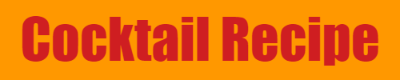
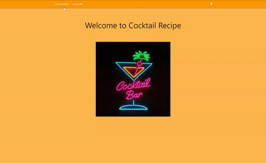

#  

Find your favorite cocktail recipe! 
If you are in for a surprise, just click "Surprise Me!"

### Description

Cocktail Recipe is a Single Page Application (SPA). It uses public API to get the recipes. This SPA has 2 main features. First feature is to search the cocktail recipe by typing in the cocktail name. Second feature will present random cocktail recipe by simply clicking on "Surprise Me!" link.

### How to use
* Fork and clone
* Open the index.html

### Credit
- API : [TheCocktailDB](https://https://www.thecocktaildb.com/api.php)
- Badges : [Shields.io](http://shields.io)
- Cocktail Recipe Banner : [Banner Maker](https://banner.godori.dev)
- CSS : [Materializecss](https://materializecss.com/)
- JavaScript library : [jQuery](https://jquery.com/)
- Neon Cocktail Bar Image : [Customneon](https://customneon.com/media/catalog/product/cache/1d858328874ebd6a1883e32a918ffc61/c/o/cocktail-glass-turnedon-customneon.jpg)
- GIF : [Video-to-gif](https://ezgif.com/video-to-gif)
- GIPHY : 